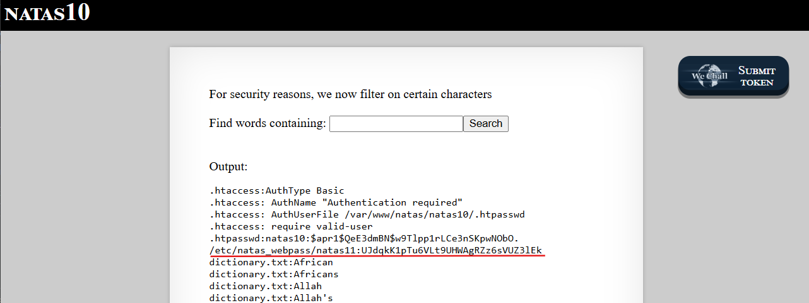

# Natas Level 10 → Level 11

### Challenge

**URL: http://natas10.natas.labs.overthewire.org/**

This level introduces a security filter using `preg_match` to block common command chaining characters:

```
if(preg_match('/[;|&]/',$key)) {
    print "Input contains an illegal character!";
} else {
    passthru("grep -i $key dictionary.txt");
}
```

The filter looks for `;` (semicolon), `|` (pipe), and `&` (ampersand). While this prevents us from executing a second independent command, it does not prevent us from passing additional arguments to the existing `grep` command.

### Walkthrough

1. The filter only blocks characters used to chain commands together. It does not block spaces or forward slashes. This means we can still manipulate the grep syntax by adding more file paths to the command.
2. Since we don't need ; or & to read the file, we use the same argument injection payload as the previous level:

```
.* /etc/natas_webpass/natas11
```



---

### Credentials Found

- **username:** `natas11`
- **Password:** `UJdqkK1pTu6VLt9UHWAgRZz6sVUZ3lEk`
