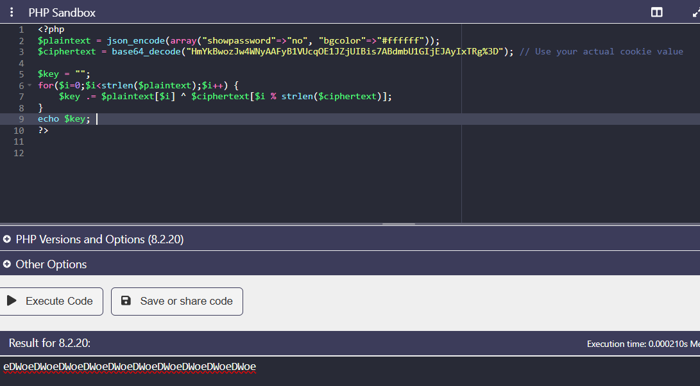
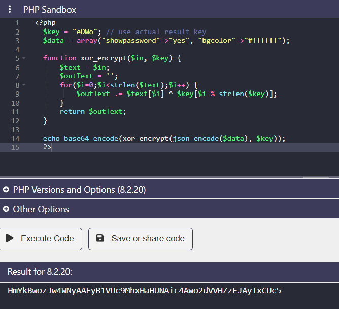
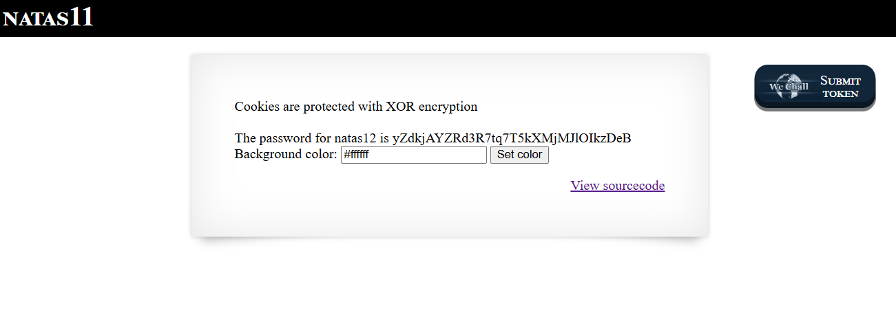

# Natas Level 11 → Level 12

### Challenge

**URL: [http://natas11.natas.labs.overthewire.org/](https://www.google.com/search?q=http://natas11.natas.labs.overthewire.org/)**

This level stores user preferences in a cookie named `data`. The data is protected using **XOR Encryption**. Because XOR is a symmetric operation, we can mathematically derive the secret key if we possess both the original **Plaintext** and the encrypted **Ciphertext**.

The fundamental property we exploit is:

$$Plaintext \oplus Ciphertext = Key$$

---

### Walkthrough

1. **Retrieve the Ciphertext:**

   Open your browser's Developer Tools (**F12**) -> **Application/Storage** -> **Cookies**. Copy the value of the `data` cookie.

2. Use the following PHP script to XOR the known default data with the cookie value you just retrieved. This will reveal the repeating secret key.

   ```
   <?php
   $plaintext = json_encode(array("showpassword"=>"no", "bgcolor"=>"#ffffff"));
   $ciphertext = base64_decode("HmYkBwozJw4WNyAAFyB1VUcqOE1JZjUIBis7ABdmbU1GIjEJAyIxTRg%3D"); // Use your actual cookie value

   $key = "";
   for($i=0;$i<strlen($plaintext);$i++) {
       $key .= $plaintext[$i] ^ $ciphertext[$i % strlen($ciphertext)];
   }
   echo $key;
   ?>
   ```

   

3. Now that we know the key is **`eDWo`**, we can encrypt a new data set where `showpassword` is set to `yes`.

   ```
   <?php
   $key = "eDWo"; // use actual result key
   $data = array("showpassword"=>"yes", "bgcolor"=>"#ffffff");

   function xor_encrypt($in, $key) {
       $text = $in;
       $outText = '';
       for($i=0;$i<strlen($text);$i++) {
           $outText .= $text[$i] ^ $key[$i % strlen($key)];
       }
       return $outText;
   }

   echo base64_encode(xor_encrypt(json_encode($data), $key));
   ?>
   ```

   

4. **Injection:**
   - Copy the output string from the second script.
   - Return to the browser's editor.
   - Replace the existing `data` cookie value with your new string.
   - Refresh the page to reveal the password.

   

---

### Credentials Found

- **Username:** `natas12`
- **Password:** `yZdkjAYZRd3R7tq7T5kXMjMJlOIkzDeB`
