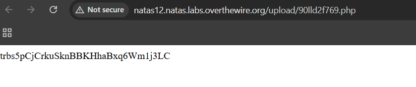

# Natas Level 12 → Level 13

### Challenge

**URL: http://natas12.natas.labs.overthewire.org/**

The website provides a simple file upload interface for JPEG images. By examining the source code, we see that the application generates a random filename but determines the file extension based on a hidden HTML input field named `filename`.

The vulnerability lies in the fact that the server trusts the user-supplied extension from the POST data without validating if the uploaded file content matches the expected format.

---

### Walkthrough

1. The PHP function `makeRandomPathFromFilename` extracts the extension from the `filename` parameter sent via the form:

   ```
   $ext = pathinfo($fn, PATHINFO_EXTENSION);
   return makeRandomPath($dir, $ext);
   ```

   Because the initial form contains a hidden field `<input type="hidden" name="filename" value="xxxx.jpg">`, we can manipulate this value to trick the server into saving our file with a `.php` extension.

2. Create a small file on your computer (e.g., `solver.php`) that contains a command to read the password for the next level:

   ```
   <?php
   echo shell_exec('cat /etc/natas_webpass/natas13');
   ?>
   ```

3. **Inject and Upload:**
   - Right-click the page and select **Inspect** (F12) to open Developer Tools.
   - Find the hidden input: `<input type="hidden" name="filename" value="[random].jpg">`.
   - Double-click the `value` and change the extension from `.jpg` to `.php`.
   - Select your `solver.php` file in the file picker and click **Upload File**.

4. After a successful upload, the page will provide a link to the file location (e.g., `upload/[random].php`). Click the link, and the server will execute the PHP code, printing the password to the screen.
   

---

### Credentials Found

- **Username:** `natas13`
- **Password:** `trbs5pCjCrkuSknBBKHhaBxq6Wm1j3LC`
