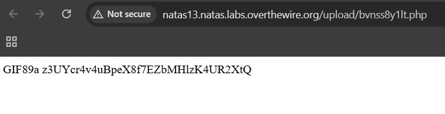

# Natas Level 13 → Level 14

### Challenge

**URL: http://natas13.natas.labs.overthewire.org/**

Level 13 is similar to the previous level but with an added security layer. The server now uses the PHP function `exif_imagetype()` to verify if the uploaded file is a genuine image. This function checks the **Magic Bytes** (the first few bytes of a file) to determine its type. If these bytes do not match a valid image format (like JPEG, PNG, or GIF), the upload will be rejected.

---

### Walkthrough

1. The server checks for real image headers. To bypass this, we need to prepend our PHP payload with the Magic Bytes of an image format. For example, the Magic Bytes for a **GIF** file are `GIF89a`

2. Create a file on your computer (e.g., `solver.php`). We will start the file with the GIF signature and then follow it with our PHP code:

   ```
   GIF89a
   <?php
   echo shell_exec('cat /etc/natas_webpass/natas14');
   ?>
   ```

   The server's `exif_imagetype() `will see `GIF89a`, assume it's a GIF image, and allow the upload.

3. **Inject and Upload:**
   - Right-click the page and select **Inspect** (F12) to open Developer Tools.
   - Find the hidden input: `<input type="hidden" name="filename" value="[random].jpg">`.
   - Double-click the `value` and change the extension from `.jpg` to `.php`.
   - Select your `solver.php` file in the file picker and click **Upload File**.

4. After a successful upload, the page will provide a link to the file location (e.g., `upload/[random].php`). Click the link, and the server will execute the PHP code, printing the password to the screen.
   

---

### Credentials Found

- **Username:** `natas14`
- **Password:** `z3UYcr4v4uBpeX8f7EZbMHlzK4UR2XtQ`
