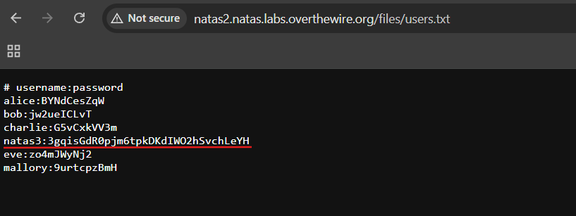

# Natas Level 2 → Level 3

### Challenge

**URL: http://natas2.natas.labs.overthewire.org/**

The page claims "there is nothing on this page." Unlike the previous levels, the password is not hidden in an HTML comment. We need to look for files or directories that might have been left accessible on the server.

### Walkthrough

- Open the source code (`Ctrl + U`). You will notice an image tag that points to a specific directory
  
- The image is stored in a folder called `/files/`. Since we can't find the password in the HTML, let's check if the server allows **Directory Indexing**. Navigate to: `http://natas2.natas.labs.overthewire.org/files/`
- Inside the directory listing, you will see two files:
  
- Open `users.txt`. This file contains a list of usernames and passwords. Look for the entry for `natas3`
  

---

### Credentials Found

- **username:** `natas3`
- **Password:** `3gqisGdR0pjm6tpkDKdIWO2hSvchLeYH`
