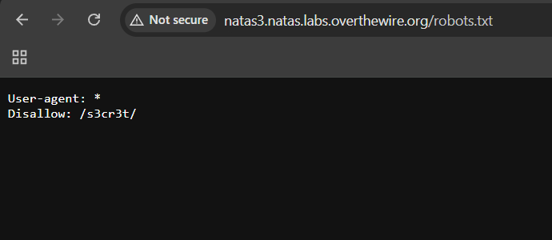
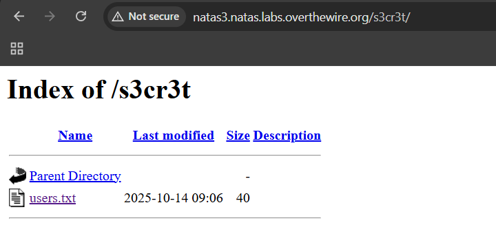

# Natas Level 2 → Level 3

### Challenge

- **URL: http://natas3.natas.labs.overthewire.org/**
  

### Walkthrough

- The phrase _" No more information leaks!! Not even Google will find it this time..."_ is a strong hint toward the **`robots.txt`** file. This file is used by websites to tell search engine crawlers (like Googlebot) which pages or directories they are not allowed to visit.
  
- Navigate to the standard location for this file by appending `/robots.txt` to the URL: `http://natas3.natas.labs.overthewire.org/robots.txt`
- The file will likely contain a "Disallow" entry. This indicates that a directory named `/s3cr3t/` exists but is hidden from search engines.
  
- Navigate to the discovered directory: `http://natas3.natas.labs.overthewire.org/s3cr3t/`
  
- Inside the directory listing, you will find a file (typically `users.txt`). Open it to find the password for the next level.
  

---

### Credentials Found

- **username:** `natas4`
- **Password:** `QryZXc2e0zahULdHrtHxzyYkj59kUxLQ`
