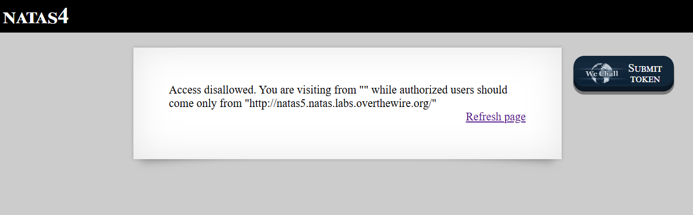
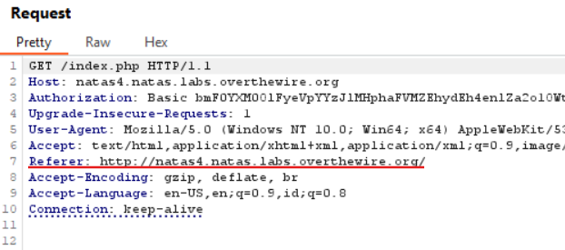
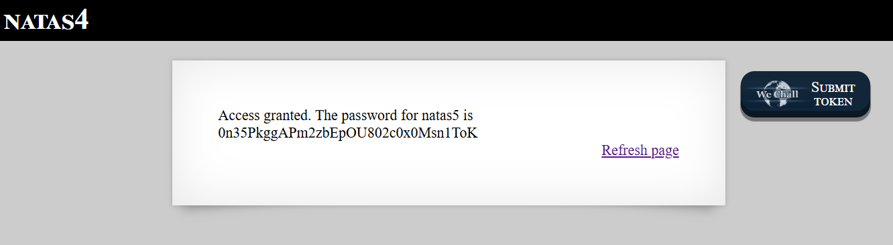

# Natas Level 2 → Level 3

### Challenge

- **URL: http://natas4.natas.labs.overthewire.org/**

Upon logging in, the page displays an error message:

"Access disallowed. You are visiting from http://natas4.natas.labs.overthewire.org/, while authorized users should come only from http://natas5.natas.labs.overthewire.org/"

This level tests your ability to manipulate HTTP Headers, specifically the Referer header, which tells the server which page you are coming from.

### Walkthrough

- The server checks the `Referer` header of your request. It expects you to originate from the Level 5 URL. Since we are currently on Level 4, our browser automatically sends the Level 4 URL as the referrer.
- **Intercept and Modify (Using Burp Suite):**
  - Open **Burp Suite** and enable the **Proxy Intercept**.
  - Refresh the Natas 4 page.
  - In the intercepted request, locate the line: `Referer: http://natas4.natas.labs.overthewire.org/`
    
  - Change the `4` to a `5`: `Referer: http://natas5.natas.labs.overthewire.org/`
  - Click **Forward**.
    

---

### Credentials Found

- **username:** `natas5`
- **Password:** `0n35PkggAPm2zbEpOU802c0x0Msn1ToK`
