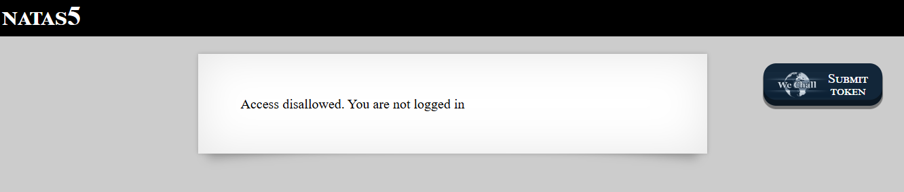
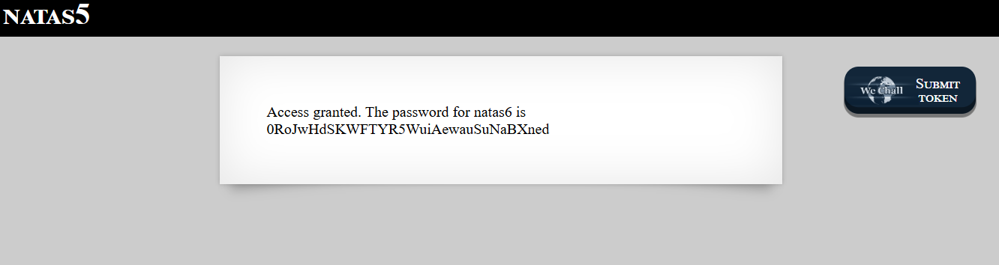

# Natas Level 5 → Level 6

### Challenge

- **URL: http://natas5.natas.labs.overthewire.org/**

When you land on the page, it displays the message:

"Access disallowed. You are not logged in."

Unlike previous levels where we looked at source code or headers, this level checks a Cookie to determine your authentication status.

### Walkthrough

- Press `F12` or `Ctrl + Shift + I` and navigate to the **Storage** tab (Firefox) or **Application** tab (Chrome/Edge).
- On the left sidebar, expand the **Cookies** section and click on the Natas 5 URL. You will see a cookie named:
  - **Name:** `loggedin`
  - **Value:** `0`
- The value `0` usually represents "False." Double-click the value and change it from **`0`** to **`1`** (representing "True").
- Once the cookie is updated, refresh the page . The server now reads the cookie as `loggedin=1` and grants you access.
  

---

### Credentials Found

- **username:** `natas6`
- **Password:** `0RoJwHdSKWFTYR5WuiAewauSuNaBXned`
