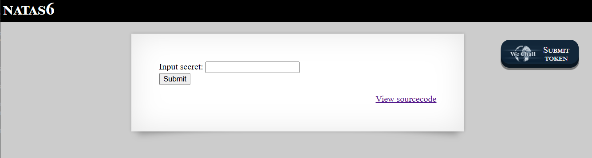
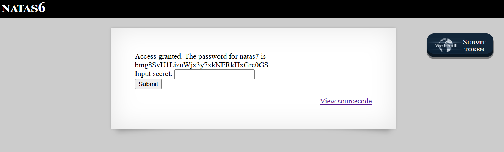

# Natas Level 6 → Level 7

### Challenge

- **URL: http://natas6.natas.labs.overthewire.org/**



The page has an input field asking for a "secret." Clicking the **"View sourcecode"** link reveals the PHP logic:

```
include "includes/secret.inc";

    if(array_key_exists("submit", $_POST)) {
        if($secret == $_POST['secret']) {
        print "Access granted. The password for natas7 is <censored>";
    } else {
        print "Wrong secret";
    }
    }
?>
```

The goal is to find the value of the `$secret` variable which is stored in the included file.

### Walkthrough

- In the source code, you see the path: `includes/secret.inc`. This is a relative path on the web server.
- Since the server doesn't block access to this directory, you can view the file by appending the path to the base URL: `http://natas6.natas.labs.overthewire.org/includes/secret.inc`
- When you open that URL. You will see the PHP variable assignment:
  ```
  <?
  $secret = "FOEIUWGHFEEUHOFUOIU";
  ?>
  ```
- **Submit the Secret:**
  - Go back to the main Natas 6 page.
  - Paste `FOEIUWGHFEEUHOFUOIU` into the input box.
  - Click **Submit Query**.
    

---

### Credentials Found

- **username:** `natas7`
- **Password:** `bmg8SvU1LizuWjx3y7xkNERkHxGre0GS`
