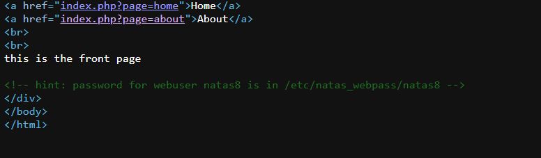
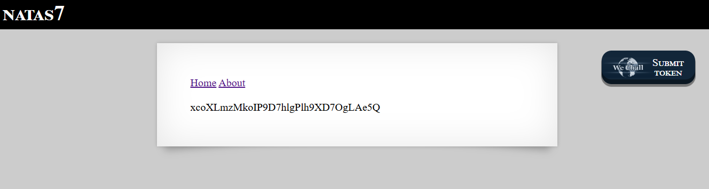

# Natas Level 7 → Level 8

### Challenge

**URL: http://natas7.natas.labs.overthewire.org/**

The website has a navigation menu (Home, About). When you click them, notice how the URL changes to include a page parameter: index.php?page=home

Looking at the source code (Ctrl + U), you will find a very helpful hint:

### Walkthrough

- The `page` parameter tells the PHP script which file to display. If the script uses a function like `include()` or `require()` without properly sanitizing the input, we can tell the server to read _any_ file on the system that it has permission to access.
- Instead of `home` or `about`, we will provide the absolute path to the password file mentioned in the hint.
- Modify the URL in your browser's address bar to: `http://natas7.natas.labs.overthewire.org/index.php?page=/etc/natas_webpass/natas8`
- The page will reload, and the content of the password file will be printed directly onto the screen.
  

---

### Credentials Found

- **username:** `natas8`
- **Password:** `xcoXLmzMkoIP9D7hlgPlh9XD7OgLAe5Q`
