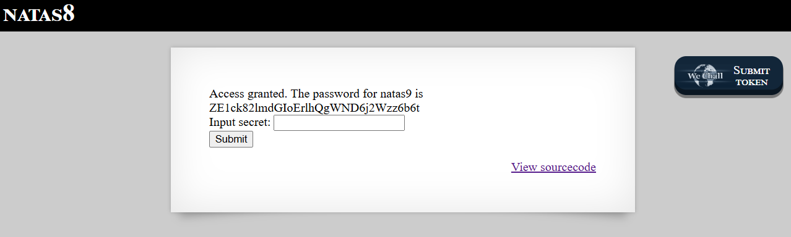

# Natas Level 8 → Level 9

### Challenge

**URL: http://natas8.natas.labs.overthewire.org/**

Clicking "View sourcecode" reveals the following PHP function used to hide the secret:

PHP

```
<?

$encodedSecret = "3d3d516343746d4d6d6c315669563362";

function encodeSecret($secret) {
    return bin2hex(strrev(base64_encode($secret)));
}

if(array_key_exists("submit", $_POST)) {
    if(encodeSecret($_POST['secret']) == $encodedSecret) {
    print "Access granted. The password for natas9 is <censored>";
    } else {
    print "Wrong secret";
    }
}
?>
```

### Walkthrough

- The `encodeSecret` function performs three operations in this specific order:
  - **Step 1:** `base64_encode($secret)`
  - **Step 2:** `strrev()` (Reverses the string)
  - **Step 3:** `bin2hex()` (Converts binary data to hexadecimal)
- To find the original secret, we must apply the inverse of these functions in the **reverse order**:
  - **Step 1:** `hex2bin()` (Convert the hex string back to binary/string)
  - **Step 2:** `strrev()` (Reverse the string back to its original orientation)
  - **Step 3:** `base64_decode()` (Decode the Base64 string)
- You can use an online PHP sandbox or a local terminal to run this logic:
  PHP
  ```
  <?php
  $encoded = "3d3d516343746d4d6d6c315669563362";
  $step1 = hex2bin($encoded);
  $step2 = strrev($step1);
  $step3 = base64_decode($step2);  // Result: "oubWYf2kBq"
  echo $step3;
  ?>
  ```
- Enter `oubWYf2kBq` into the input field on the Natas 8 page and click **Submit**.
  

---

### Credentials Found

- **username:** `natas9`
- **Password:** `ZE1ck82lmdGIoErlhQgWND6j2Wzz6b6t`
