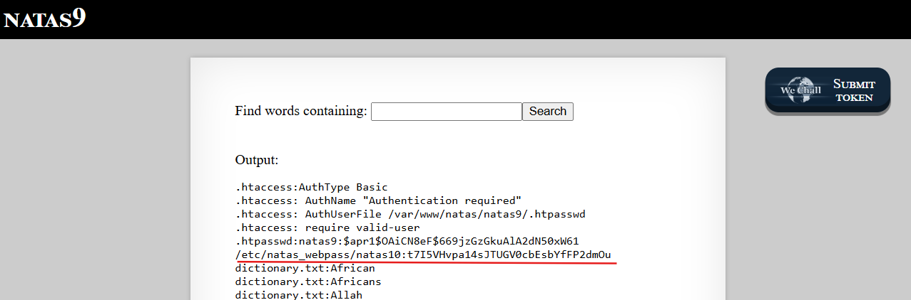

# Natas Level 9 → Level 10

### Challenge

**URL: http://natas9.natas.labs.overthewire.org/**

The search function on this page uses the PHP `passthru()` function to execute a system-level `grep` command. The backend code looks like this:

```
passthru("grep -i $key dictionary.txt");
```

The variable `$key` is directly populated by the search box input. Because the application fails to sanitize this input, we can inject additional arguments to the `grep` command, turning a simple search into a tool to read sensitive system files.

### Walkthrough

1.  The `grep` command follows the format: `grep [options] [pattern] [file]`. By adding a space after our search pattern, we can trick `grep` into thinking we are providing a list of multiple files to search through.
2.  To read the password file for the next level, use the following input in the search box:

    ```
    .* /etc/natas_webpass/natas10
    ```

3.  **How it Works:**
    - The full command becomes: `grep -i .* /etc/natas_webpass/natas10 dictionary.txt`
    - `.*` is a regular expression meaning "match everything."
    - `grep` searches for "everything" inside `/etc/natas_webpass/natas10` first, then in `dictionary.txt`.

    

---

### Credentials Found

- **username:** `natas10`
- **Password:** `t7I5VHvpa14sJTUGV0cbEsbYfFP2dmOu`
